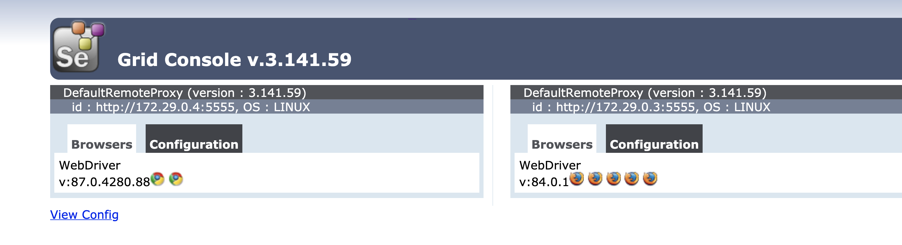

# protractor-course

Project for the Protractor course of the [Talking About Testing school](https://udemy.com/user/walmyr).

## Pre-requirements

The following systems need to be installed for running this project.

- Docker
- Node.JS (`v14.15.0`)
- NPM (`6.14.8`)

> **Note:** The above-mentioned versions were used during the course's recording.

## Installation

After cloning the project, access its director (`cd protractor-course`) and run `npm install` to install the dev dependencies.

## Before running the tests

Before running the tests, make sure that Selenium hub, Chrome headless, and Firefox headless containers are up and runnning.

> To pull the above-mentioned containers, run `npm run docker:pull`

> Use `npm run docker:ls` to check if they are up and running.

> If the containers are not running, use `npm run docker:up` to start them.

> To restart the containers, use `npm run docker:restart`.

> To shut down the containers, use `npm run docker:down`.

### Checking Selenium Grid

With the containers up and running, access the following URL on your preferred browser to check that the Selenium Grid is correctly set up: http://localhost:4444/grid/console.

> You should see app like the below one.

## Running the tests

Run `npm test` to execute the tests in headless mode on both Chrome and Firefox.

### Running the tests on a specific browser

#### Pre-condition

Run `npm run pretest` to update the webdriver-manager.

#### Chrome

Run `npm run test:chrome` to execute the tests in headless mode on Chrome.

#### Firefox

Run `npm run test:firefox` to execute the tests in headless mode on Firefox.

___

A project from the [Talking About Testing school](https://udemy.com/user/walmyr).
